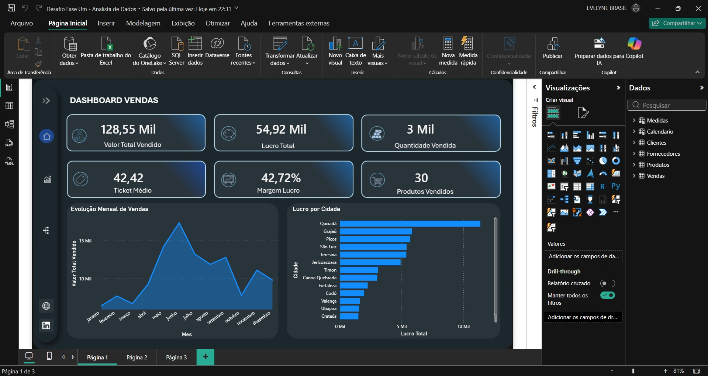
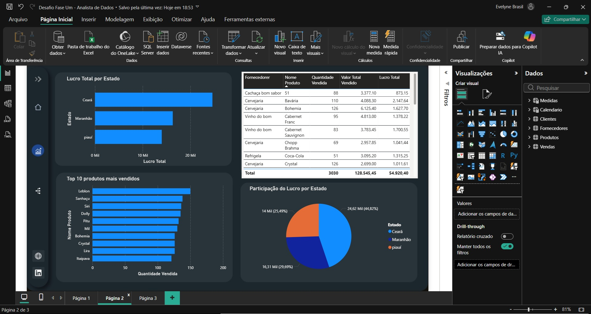
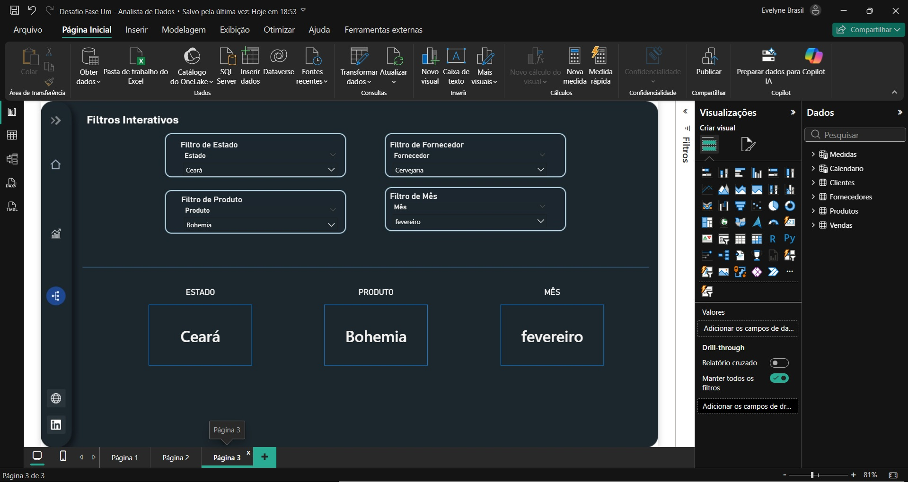

# 📊 Desafio Fase 1 - Analista de Dados

Projeto desenvolvido em Power BI com foco em análise de vendas, ETL, modelagem de dados e visualização interativa.

---

# 🚀 Objetivo

Transformar dados brutos de vendas em informações estratégicas para apoio à tomada de decisão.

---

# 🛠 Ferramentas Utilizadas

- Power BI
- Power Query
- DAX
- Excel
- Modelagem Relacional

---

# 📌 Principais Funcionalidades

✅ ETL e tratamento de dados  
✅ Modelagem relacional  
✅ Criação de KPIs  
✅ Dashboard interativo  
✅ Navegação entre páginas  
✅ Segmentações dinâmicas  
✅ Indicadores de desempenho  

---

# 📈 Indicadores Desenvolvidos

- Valor Total Vendido
- Lucro Total
- Margem de Lucro
- Ticket Médio
- Quantidade Vendida
- Produtos Vendidos

---

# 📊 Análises Realizadas

- Evolução mensal de vendas
- Lucro por cidade
- Top produtos vendidos
- Participação do lucro por estado
- Performance de fornecedores

---

# 🖼 Preview do Dashboard

## Página 1


## Página 2


## Página 3


---

# 📂 Estrutura do Projeto

```text
Bases/
Dashboard.pbix
README.md
